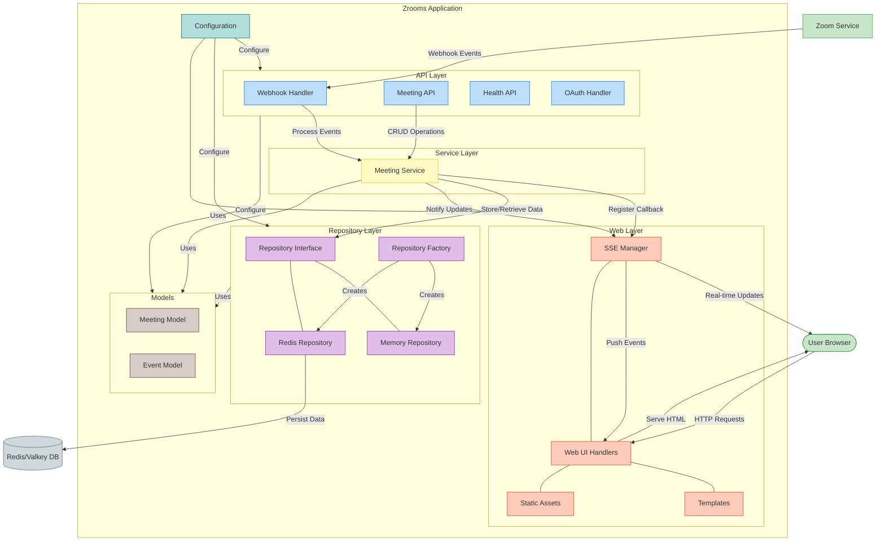

```mermaid
graph TD
    %% External Components
    Zoom["Zoom Service"] -->|Webhook Events| API_Webhook
    User(["User Browser"]) -->|HTTP Requests| Web_UI
    
    %% Main Application Components
    subgraph Zrooms["Zrooms Application"]
        %% API Layer
        subgraph API["API Layer"]
            API_Webhook["Webhook Handler"]
            API_Meetings["Meeting API"]
            API_Health["Health API"]
            API_OAuth["OAuth Handler"]
        end
        
        %% Service Layer
        subgraph Service["Service Layer"]
            Meeting_Service["Meeting Service"]
        end
        
        %% Repository Layer
        subgraph Repository["Repository Layer"]
            Repo_Interface["Repository Interface"]
            Repo_Memory["Memory Repository"]
            Repo_Redis["Redis Repository"]
            Repo_Factory["Repository Factory"]
            
            Repo_Interface --- Repo_Memory
            Repo_Interface --- Repo_Redis
            Repo_Factory -->|Creates| Repo_Memory
            Repo_Factory -->|Creates| Repo_Redis
        end
        
        %% Web Layer
        subgraph Web["Web Layer"]
            Web_UI["Web UI Handlers"]
            Web_Templates["Templates"]
            Web_Static["Static Assets"]
            SSE_Manager["SSE Manager"]
            
            Web_UI --- Web_Templates
            Web_UI --- Web_Static
            Web_UI --- SSE_Manager
        end
        
        %% Data Models
        subgraph Models["Models"]
            Meeting_Model["Meeting Model"]
            Event_Model["Event Model"]
        end
        
        %% Configuration
        Config["Configuration"]
    end
    
    %% Data Stores
    Redis[(Redis/Valkey DB)]
    
    %% Connections and Data Flow
    API_Webhook -->|Process Events| Meeting_Service
    API_Meetings -->|CRUD Operations| Meeting_Service
    Meeting_Service -->|Register Callback| SSE_Manager
    Meeting_Service -->|Store/Retrieve Data| Repo_Interface
    Repo_Redis -->|Persist Data| Redis
    
    %% Config connections
    Config -->|Configure| API
    Config -->|Configure| Repository
    Config -->|Configure| Web
    
    %% Model usage
    Meeting_Service -->|Uses| Models
    API -->|Uses| Models
    Repository -->|Uses| Models
    
    %% User interaction
    Web_UI -->|Serve HTML| User
    SSE_Manager -->|Real-time Updates| User
    
    %% Notification flow
    Meeting_Service -->|Notify Updates| SSE_Manager
    SSE_Manager -->|Push Events| Web_UI

    %% Class definitions for styling
    classDef external fill:#c8e6c9,stroke:#43a047
    classDef api fill:#bbdefb,stroke:#1976d2
    classDef service fill:#fff9c4,stroke:#fbc02d
    classDef repository fill:#e1bee7,stroke:#8e24aa
    classDef web fill:#ffccbc,stroke:#e64a19
    classDef models fill:#d7ccc8,stroke:#5d4037
    classDef config fill:#b2dfdb,stroke:#00796b
    classDef database fill:#cfd8dc,stroke:#546e7a
    
    %% Class assignments
    class Zoom,User external
    class API_Webhook,API_Meetings,API_Health,API_OAuth api
    class Meeting_Service service
    class Repo_Interface,Repo_Memory,Repo_Redis,Repo_Factory repository
    class Web_UI,Web_Templates,Web_Static,SSE_Manager web
    class Meeting_Model,Event_Model models
    class Config config
    class Redis database
```